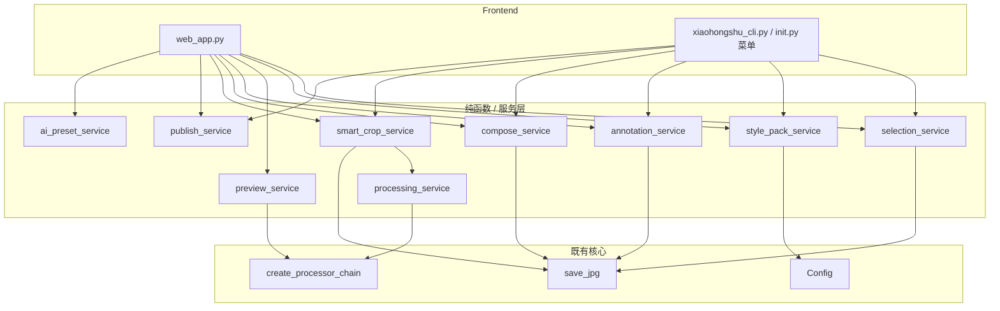
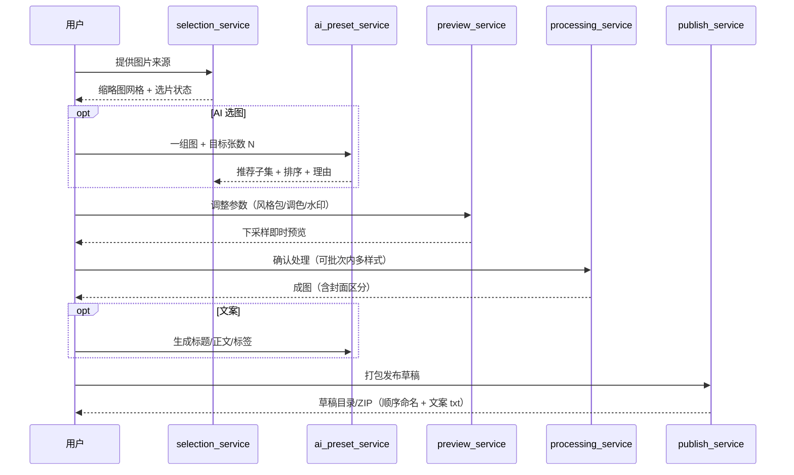

# Design Document

> 设计文档：小红书发图工作流增强

## Overview

本设计在不破坏 Semi-Utils 现有架构（配置驱动 + 处理器链 + 纯函数 service + CLI/Web 双前端）的前提下，补齐用户旅程的“选片 / 复用 / 内容扩展 / 智能加工 / 发布”五块能力，对应需求 1–10。

核心设计原则：
1. **图像逻辑纯函数化**：所有新图像能力放入独立 service 模块，输入 PIL.Image、输出新 PIL.Image，不修改/不关闭入参；CLI、Web、实时预览三处共用同一套函数，杜绝实现分叉（满足非功能性需求“一致性”）。
2. **重依赖可选化**：OpenCV 等通过延迟导入 + 能力探测（`is_xxx_available()`）封装，缺失时优雅降级，绝不阻断模块导入或核心流程。
3. **AI 能力收敛到一处**：需求 2、9 全部复用 `ai_preset_service` 已有的多服务商、下采样、超时重试、JSON 解析、友好错误、成本预估机制，只新增 prompt 与结果归一化函数。
4. **配置向后兼容**：新配置项一律 `setdefault` 初始化；风格包构建在现有 `custom_presets.json` 之上做超集扩展。

### 模块划分

| 模块 | 职责 | 对应需求 |
|---|---|---|
| `selection_service.py`（新） | 缩略图生成、选片状态模型、导出选中 | 1 |
| `ai_preset_service.py`（扩展） | AI 选图排序、风格/标签建议 | 2、9 |
| `style_pack_service.py`（新） | 风格包 schema、序列化、导入导出、校验、默认补齐 | 3 |
| `preview_service.py`（新） | 基于下采样 + 现有处理链的实时预览 | 4 |
| `annotation_service.py`（新） | 文字贴纸/标注渲染 | 6 |
| `compose_service.py`（新） | 长图拼接、前后对比图 | 7 |
| `smart_crop_service.py`（新） | 显著性 + 可选人脸的智能裁切 | 8 |
| `publish_service.py`（新） | 发布草稿打包（图 + 文案/标签） | 10 |
| `processing_service.py`（扩展） | 批次内多样式、智能裁切作为统一尺寸策略 | 5、8 |
| `entity/config.py`（扩展） | 新配置项 + getter/setter | 3、5、6、8 |
| `web_app.py` / `xiaohongshu_cli.py`（扩展） | UI 接入 | 全部 |

### 架构图



---

## Architecture

### 数据流：选片 → 加工 → 发布



---

## Components and Interfaces

### 1. selection_service.py（需求 1）

```python
@dataclass
class SelectionItem:
    path: Path
    selected: bool = False
    stars: int = 0          # 0–5

def make_thumbnail(image_path: Path, max_side: int = 480) -> Image.Image:
    """读取并下采样为缩略图，失败抛 SelectionError（调用方跳过）。"""

def build_selection(paths: list[Path]) -> list[SelectionItem]:
    """构建选片模型；读取失败的图跳过。"""

def filter_items(items, only_selected: bool = False, min_stars: int = 0) -> list[SelectionItem]:
    """按选中/星级过滤。"""

def export_selected(items, out_dir: Path, add_index_prefix: bool = True,
                    quality: int = 95) -> list[Path]:
    """把选中项按当前顺序导出，可加 01_/02_ 前缀。复用 save_jpg。"""
```
- Web 端用 `st.session_state` 持有 `list[SelectionItem]` 状态，缩略图用 `make_thumbnail` 下采样（满足验收 6）。
- 单图读取失败 `try/except` 跳过（验收 7）。

### 2. ai_preset_service.py 扩展（需求 2、9）

```python
def select_best_images(image_paths, target_count, user_goal, api_key,
                       model=DEFAULT_MODEL, base_url=None,
                       max_images=12) -> dict:
    """
    返回 {"order": [int...], "reason": str}，order 为基于输入顺序的 0-based 索引。
    复用 _build_client / _chat_json / estimate_usage / 下采样。
    """

def _normalize_selection(result: dict, n: int, target: int) -> dict:
    """把模型返回的 index 列表夹到 [0, n) 去重，截断到 target；非法项忽略（验收 4）。"""

def suggest_style_and_tags(image_paths, user_goal, api_key,
                           model=DEFAULT_MODEL, base_url=None) -> dict:
    """返回 {"filter": <FILTER 集合内或 none>, "tags": [...], "reason": str}。"""
```
- 图片以序号标注发送（"第 1 张/第 2 张..."），模型按序号返回，映射回原始 `image_paths`（验收 3）。
- `filter` 校验落在 `color_service.FILTER_PRESETS` 内，否则 `none`（需求 9 验收 2）。
- 复用现有异常 → `AIServiceError` 友好提示；缺 openai/Key 时上层捕获提示，不影响手动选片（验收 6、7）。

### 3. style_pack_service.py（需求 3）

风格包是现有 `build_preset_snapshot()` 的超集，新增调色/水印/隐私维度，并带版本号。

```python
STYLE_PACK_VERSION = 1
STYLE_PACK_FIELDS = {  # 字段 -> 默认值，用于补齐
    "layout_type": "watermark_right_logo", "logo_enable": False, "logo_position": "left",
    "white_margin": False, "white_margin_width": 3, "shadow_enable": False,
    "equivalent_focal": False, "original_ratio_padding": False,
    "uniform_enable": False, "uniform_mode": "padding",
    "uniform_width": 1080, "uniform_height": 1440, "quality": 100,
    "color_filter": "none", "color_brightness": 1.0, "color_contrast": 1.0,
    "color_saturation": 1.0, "color_sharpness": 1.0, "color_temperature": 0,
    "auto_contrast": False,
    "tw_enable": False, "tw_text": "", "tw_tiled": True, "tw_opacity": 0.15,
    "elements": {...},
}

def normalize_style_pack(data: dict) -> dict:
    """补齐缺失字段（验收 6），过滤非法值。"""

def serialize_style_pack(snapshot: dict) -> str:        # 导出 JSON（含 version）
def deserialize_style_pack(text: str) -> dict:          # 导入；结构非法抛 StylePackError（验收 4）
def is_legacy_preset(data: dict) -> bool:               # 识别旧 custom_presets 条目
```
- 存储沿用 `app_data/custom_presets.json`；旧条目缺新字段时 `normalize_style_pack` 自动补齐（验收 7、6）。
- 导入导出为单个 JSON 文件（验收 3、4）。
- 内置风格包不可删（验收 5），与现有 `PRESET_TEMPLATES` 一致。

### 4. preview_service.py（需求 4）

```python
def render_preview(sample_path: Path, config: Config, max_side: int = 900) -> Image.Image:
    """
    将样图下采样到 max_side，用 create_processor_chain(config) 跑同一条链，
    返回预览图。出错抛 PreviewError，由上层保留上次成功预览。
    """
```
- 关键：**复用 `create_processor_chain` 与 `ImageContainer`**，保证预览与正式输出视觉一致（验收 3）。
- 通过把样图先缩到 `max_side` 再进链来提速（验收 2）。
- Web 端在侧边栏参数变化后调用；用 `st.session_state["last_preview"]` 缓存，出错时回退（验收 4）。
- 由于 `ImageContainer` 以路径构造并读 EXIF，预览将提供一个轻量路径输入；下采样图写入临时文件或扩展 container 支持注入图像（设计选择见下）。

> **设计选择（预览如何复用链）**：`ImageContainer` 目前从磁盘路径构造。为预览，新增可选构造方式：把下采样图存入临时文件后用现有路径构造（实现简单、零侵入），而非改动 `ImageContainer` 内部。权衡：每次预览一次磁盘 IO，但样图已下采样，开销可接受，且不引入并发/状态风险。

### 5. processing_service.py 扩展（需求 5、8）

**批次内多样式**：
```python
def process_images_with_cover(source_paths, output_dir, cover_config, body_config,
                              cover_index=0) -> list[ProcessResult]:
    """封面用 cover_config 链、其余用 body_config 链。cover_index 越界回退 0（验收 4）。"""
```
- 不改动现有 `process_images`（验收 2 保持现有行为），新增并行入口。

**智能裁切作为统一尺寸策略**：在 `UNIFORM_RESIZE_MODES` 增加 `"smart"` 模式；`UniformResizeProcessor` 当 mode == "smart" 时调用 `smart_crop_service`，失败回退 `crop`（需求 8 验收 3、4、5）。

### 6. smart_crop_service.py（需求 8）

```python
def is_face_detection_available() -> bool:
    """探测 cv2 是否可用。"""

def saliency_crop(image, target_w, target_h) -> Image.Image:
    """纯 PIL 显著性：用边缘/对比度能量图估计重心，定位裁切窗口。"""

def smart_crop(image, target_w, target_h) -> Image.Image:
    """
    1) 若 cv2 可用 → 人脸检测，保证人脸框在裁切窗口内；
    2) 否则 → saliency_crop；
    3) 任何异常 → crop_image_to_canvas（居中裁切兜底）。
    返回新图，不动原图（验收 6）。
    """
```
- **依赖策略**：OpenCV 为可选依赖。纯 PIL 显著性始终可用（无新依赖），保证“开箱即降级可用”；装了 `opencv-python` 才启用人脸优先（验收 1、2、3、4）。
- 显著性算法：`ImageFilter.FIND_EDGES` + 灰度，按行/列能量积分求加权重心，再以该重心为锚点放置目标比例窗口并夹到边界内。无需训练模型、无新依赖。

### 7. annotation_service.py（需求 6）

```python
@dataclass
class Annotation:
    text: str
    x: float            # 0–1 相对坐标
    y: float
    style: str = "bubble"   # bubble / plain / price
    text_color: str = "#ffffff"
    bg_color: str = "#000000"
    font_scale: float = 0.04

def add_annotations(image, annotations: list[Annotation],
                    font_path: Optional[str] = None) -> Image.Image:
    """按顺序叠加全部标注，返回新 RGB 图；空文本跳过（验收 6）。"""
```
- 复用 `color_service` 已有的字体加载与圆角矩形思路。三种样式：气泡（圆角底 + 文字）、纯文字（描边）、价格标签（高亮底色）。

### 8. compose_service.py（需求 7）

```python
def stack_vertical(images: list[Image.Image], gap=0, bg_color="white",
                   align_width=True) -> Image.Image:
    """等宽对齐后纵向拼接成长图（验收 1）。"""

def make_comparison(img_a, img_b, layout="lr", gap=8, divider=True,
                    labels: Optional[tuple[str, str]] = None) -> Image.Image:
    """左右(lr)/上下(tb) 对比图，可选分隔线与 Before/After 标签（验收 2、3）。"""
```
- 输入不足 2 张由上层 UI 提示（验收 5）。复用 `resize_image_with_width/height`、`merge_images`。

### 9. publish_service.py（需求 10）

```python
def build_publish_draft(image_paths: list[Path], caption: dict,
                        out_dir: Path, as_zip: bool = False) -> Path:
    """
    生成草稿：图片按 01_/02_ 顺序命名复制，写 caption.txt（标题/正文/#标签）。
    无文案时 caption.txt 仅占位（验收 3）。返回目录或 zip 路径。
    """
```
- 复用 `make_zip_bytes` 思路（Web）与 `save_jpg`；输出目录沿用 `output_xiaohongshu/draft`（验收 5）。

### 10. config.py 扩展（需求 5、6、8）

`_initialize_defaults` 新增（均 `setdefault`）：
```yaml
global:
  smart_crop: { enable: false }          # 需求 8（uniform_resize.mode 增加 'smart' 选项）
  batch_style: { cover_separate: false, cover_index: 0 }  # 需求 5
```
- 需求 3/6 的状态主要存于 `app_data`（风格包 JSON、标注为前端临时态），不污染 `config.yaml`。
- `UNIFORM_RESIZE_MODES` 增加 `("智能裁切", "smart")`。

---

## Data Models

### 风格包 JSON（导出格式）
```json
{
  "version": 1,
  "name": "我的清新风",
  "snapshot": { "layout_type": "...", "color_filter": "fresh", "...": "..." }
}
```

### AI 选图返回（归一化后）
```json
{ "order": [2, 0, 5, 1], "reason": "构图与色调统一，叙事顺序流畅" }
```

### 选片状态（运行时）
```text
list[SelectionItem(path, selected, stars)]
```

---

## Error Handling

| 场景 | 策略 | 关联验收 |
|---|---|---|
| 选片中单图读取失败 | try/except 跳过，继续 | 1.7 |
| AI 缺 openai/Key | 上层捕获 → 提示，不影响手动选片 | 2.7 |
| AI 返回非法 index/filter | 归一化阶段忽略/回退 none | 2.4, 9.2 |
| AI 调用失败 | 复用 `AIServiceError` 友好中文 + 保留手动结果 | 2.6 |
| 风格包文件非法 | `StylePackError` 提示，不污染现有数据 | 3.4 |
| 风格包缺字段 | `normalize_style_pack` 默认补齐 | 3.6 |
| 预览处理出错 | 保留上次成功预览 + 提示 | 4.4 |
| 封面序号越界 | 回退第一张 | 5.4 |
| OpenCV 缺失/检测失败 | 回退显著性 → 再回退居中裁切 | 8.3, 8.4 |
| 拼接/对比输入不足 | UI 提示 | 7.5 |

统一沿用现有 `*ServiceError(Exception)` 携带中文提示的模式。

---

## Correctness Properties

以下为程序必须始终满足的可执行正确性属性（用于属性测试 / 回归校验）：

### Property 1: 不破坏入参
对任意输入图，所有图像服务函数（`add_annotations`、`stack_vertical`、`make_comparison`、`smart_crop`、`saliency_crop`、`export_selected` 内部转换）返回后，原始传入的 PIL.Image 仍可访问且尺寸不变。

**Validates: Requirements 6.5, 7.4, 8.6**

### Property 2: 裁切尺寸精确
`smart_crop(image, w, h)` 与所有降级路径的输出尺寸必须恰好等于 `(w, h)`。

**Validates: Requirements 8.1, 8.5**

### Property 3: 智能裁切总能产出
无论 OpenCV 是否可用、检测是否失败，`smart_crop` 必须返回有效图（绝不抛出未捕获异常）。

**Validates: Requirements 8.3, 8.4**

### Property 4: AI 选图索引合法
`_normalize_selection` 的输出 `order` 必须是 `[0, n)` 范围内、无重复、长度 ≤ target 的整数序列。

**Validates: Requirements 2.3, 2.4**

### Property 5: 风格包往返一致
对任意合法快照，`deserialize_style_pack(serialize_style_pack(x))` 的 `snapshot` 经 `normalize_style_pack` 后与 `normalize_style_pack(x)` 等价。

**Validates: Requirements 3.3, 3.4**

### Property 6: 风格包字段完备
`normalize_style_pack` 的输出必定包含 `STYLE_PACK_FIELDS` 的全部键。

**Validates: Requirements 3.6, 3.7**

### Property 7: 滤镜建议封闭性
`suggest_style_and_tags` 归一化后的 `filter` 必属于 `FILTER_PRESETS` 的键集合。

**Validates: Requirements 9.1, 9.2**

### Property 8: 发布草稿顺序性
`build_publish_draft` 产出的图片文件名前缀序号严格递增且与输入顺序一致。

**Validates: Requirements 10.1, 10.2**

### Property 9: 过滤单调性
`filter_items(items, min_stars=k)` 的结果是 `items` 中 `stars >= k` 的子集，且保持原顺序。

**Validates: Requirements 1.4**

## Testing Strategy

不联网、不依赖重库即可验证的纯逻辑（重点测试对象）：
- **几何/合成**：`stack_vertical`、`make_comparison`、`add_annotations`、`saliency_crop` 的输出尺寸、不破坏入参、空输入处理。
- **风格包**：`serialize/deserialize` 往返一致；缺字段补齐；非法 JSON 抛 `StylePackError`；旧 preset 兼容。
- **AI 结果映射**：`_normalize_selection` 对越界/重复/超量/非法索引的夹取与截断；`suggest_style_and_tags` 的 filter 回退。
- **智能裁图降级**：mock `is_face_detection_available()=False` 时回退显著性；显著性异常时回退居中裁切；输出尺寸严格等于目标。
- **选片**：`make_thumbnail` 下采样尺寸上限；`filter_items` 过滤逻辑；`export_selected` 顺序与前缀命名。
- **发布草稿**：顺序命名 `01_/02_`；无文案占位；目录/zip 两种产物。

联网类（AI 选图/建议）：用无效 Key 验证错误路径与降级，与现有 AI 验证方式一致；真实调用由用户在配置 Key 后手动验证。

验证方式沿用项目惯例：临时脚本用 `input/` 真实样图跑纯逻辑 + pyflakes + 编译检查，验证后清理临时文件。
