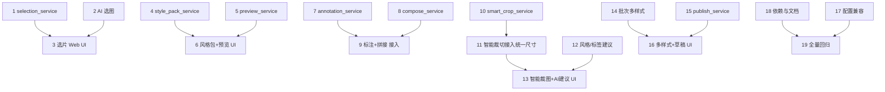

# Implementation Plan

> 实现任务清单：小红书发图工作流增强

## Overview

任务按“纯逻辑 service 先行 → 配置/处理链接入 → CLI/Web UI 接入 → 文档/回归”分层组织，并按价值优先级排序：

- **P0**：选片（阶段 A）、风格包 + 实时预览（阶段 B）
- **P1**：内容扩展标注/拼接（阶段 C）、智能裁图 + AI 建议（阶段 D）
- **P2**：批次内多样式 + 发布草稿（阶段 E）
- 收尾：配置兼容、依赖与文档、全量回归（阶段 F）

每个 service 任务完成后，用 `input/` 真实样图写临时脚本验证纯逻辑，再 pyflakes + 编译，验证后清理临时文件。可在任一阶段结束时叫停，已完成阶段即为可用增量。

## Task Dependency Graph

```json
{
  "waves": [
    { "wave": 1, "tasks": ["1", "2", "4", "5", "7", "8", "10", "12", "14", "15"] },
    { "wave": 2, "tasks": ["3", "6", "9", "11", "17"] },
    { "wave": 3, "tasks": ["13", "16"] },
    { "wave": 4, "tasks": ["18"] },
    { "wave": 5, "tasks": ["19"] }
  ]
}
```

依赖关系图（按阶段推进，阶段间相互独立）：



- **Wave 1**：全部纯逻辑 service（无相互依赖，可并行实现与验证）
- **Wave 2**：依赖各自 service 的 UI/处理链接入 + 配置兼容
- **Wave 3**：依赖 Wave 2 的组合型 UI（智能裁图+AI建议、多样式+草稿）
- **Wave 4-5**：文档更新与全量回归收尾

## Tasks

### 阶段 A：选片（需求 1、2）— P0

- [x] 1. 实现 selection_service 纯逻辑
  - 新建 `selection_service.py`：`SelectionItem` dataclass、`make_thumbnail`、`build_selection`、`filter_items`、`export_selected`、`SelectionError`
  - `make_thumbnail` 对大图下采样到 `max_side`；`build_selection` 对读取失败的图跳过；`export_selected` 复用 `xiaohongshu_service.save_jpg`，按顺序加 `01_` 前缀
  - 写临时脚本验证：缩略图尺寸上限、过滤单调性（Property 9）、导出顺序与前缀命名
  - _Requirements: 1.1, 1.2, 1.3, 1.4, 1.5, 1.6, 1.7_

- [x] 2. 在 ai_preset_service 增加 AI 选图
  - 新增 `select_best_images(...)` 与 `_normalize_selection(result, n, target)`
  - 图片以序号标注发送，复用 `_build_client`/`_chat_json`/`estimate_usage`/下采样；结果映射回原始顺序
  - `_normalize_selection` 保证索引落在 `[0, n)`、去重、截断到 target（Property 4）
  - 写临时脚本验证 `_normalize_selection` 对越界/重复/超量/非法输入的处理（不联网）
  - _Requirements: 2.1, 2.2, 2.3, 2.4, 2.5_

- [x] 3. 选片 Web UI 接入
  - 在小红书工具区新增“选片”tab：网格缩略图、选中切换、星级、过滤、导出选中
  - 接入 AI 选图按钮：成本预估、把推荐结果标注到选片状态；失败保留手动结果
  - 缺 openai/Key 时提示而不影响手动选片
  - _Requirements: 1.1, 1.2, 1.3, 1.4, 1.5, 2.5, 2.6, 2.7_

### 阶段 B：风格包 + 实时预览（需求 3、4）— P0

- [x] 4. 实现 style_pack_service 纯逻辑
  - 新建 `style_pack_service.py`：`STYLE_PACK_VERSION`、`STYLE_PACK_FIELDS`、`normalize_style_pack`、`serialize_style_pack`、`deserialize_style_pack`、`is_legacy_preset`、`StylePackError`
  - 字段为现有 `build_preset_snapshot` 的超集（加调色/水印维度）
  - 写临时脚本验证：往返一致（Property 5）、字段补齐（Property 6）、非法 JSON 抛错、旧 preset 兼容
  - _Requirements: 3.1, 3.2, 3.3, 3.4, 3.5, 3.6, 3.7_

- [x] 5. 实现 preview_service 纯逻辑
  - 新建 `preview_service.py`：`render_preview(sample_path, config, max_side)`、`PreviewError`
  - 复用 `create_processor_chain` 与 `ImageContainer`（下采样图写临时文件后用现有路径构造，零侵入）
  - 写临时脚本验证：预览图尺寸受 `max_side` 约束、与正式链使用同一处理器、出错抛 `PreviewError`
  - _Requirements: 4.1, 4.2, 4.3, 4.4, 4.5_

- [x] 6. 风格包 + 预览 Web UI 接入
  - 侧边栏：保存/应用/删除风格包、导出下载 JSON、导入上传 JSON（复用 `build_preset_snapshot` 扩展为全维度快照）
  - 主区：参数变化后调用 `render_preview` 即时刷新；缓存上次成功预览，出错回退并提示；无样图时提示
  - _Requirements: 3.1, 3.2, 3.3, 3.4, 3.5, 4.1, 4.4, 4.5_

### 阶段 C：内容扩展（需求 6、7）— P1

- [x] 7. 实现 annotation_service 纯逻辑
  - 新建 `annotation_service.py`：`Annotation` dataclass、`add_annotations`，支持 bubble/plain/price 三种样式与相对坐标
  - 返回新图、不动入参；空文本跳过
  - 写临时脚本验证：多标注顺序渲染、空文本跳过、不破坏入参（Property 1）
  - _Requirements: 6.1, 6.2, 6.3, 6.4, 6.5, 6.6_

- [x] 8. 实现 compose_service 纯逻辑
  - 新建 `compose_service.py`：`stack_vertical`、`make_comparison`（lr/tb、分隔线、Before/After 标签）
  - 复用 `resize_image_with_width/height`、`merge_images`；返回新图、不动入参
  - 写临时脚本验证：长拼接等宽对齐、对比图尺寸、标签渲染、不破坏入参（Property 1）
  - _Requirements: 7.1, 7.2, 7.3, 7.4, 7.5_

- [x] 9. 标注 + 拼接 CLI 与 Web 接入
  - 小红书工具区新增“标注”“长图/对比”子工具；CLI 增加对应菜单项
  - 输入不足 2 张时 UI 提示（拼接/对比）
  - _Requirements: 6.1, 6.2, 6.3, 7.1, 7.2, 7.3, 7.5_

### 阶段 D：智能裁图 + AI 建议（需求 8、9）— P1

- [x] 10. 实现 smart_crop_service 纯逻辑
  - 新建 `smart_crop_service.py`：`is_face_detection_available`、`saliency_crop`、`smart_crop`
  - 纯 PIL 显著性（边缘能量重心）始终可用；OpenCV 人脸为可选增强；任何异常回退 `crop_image_to_canvas`
  - 写临时脚本验证：输出尺寸恰为目标（Property 2）、mock 无 cv2 时降级、显著性异常回退、绝不抛异常（Property 3）、不破坏入参（Property 1）
  - _Requirements: 8.1, 8.2, 8.3, 8.4, 8.6_

- [x] 11. 智能裁切接入统一尺寸
  - `UNIFORM_RESIZE_MODES` 增加 `("智能裁切", "smart")`；`UniformResizeProcessor` 在 mode=="smart" 时调用 `smart_crop`，失败回退 crop
  - `config.py` 的 `get_uniform_resize_mode` 放开 `smart` 取值
  - 写临时脚本验证：smart 模式经处理链输出尺寸正确
  - _Requirements: 8.5_

- [x] 12. 在 ai_preset_service 增加风格/标签建议
  - 新增 `suggest_style_and_tags(...)`：返回 filter（限定在 `FILTER_PRESETS` 内，否则 none）+ 去 # 标签 + 理由
  - 复用现有 AI 机制；写临时脚本验证 filter 封闭性（Property 7）与标签归一化
  - _Requirements: 9.1, 9.2, 9.3, 9.4_

- [x] 13. 智能裁图 + AI 建议 UI 接入
  - 多比例导出/统一尺寸 UI 暴露“智能裁切”选项
  - AI 建议按钮：展示推荐滤镜+理由+标签，“采纳滤镜”一键应用到当前配置
  - _Requirements: 8.5, 9.1, 9.3, 9.5_

### 阶段 E：批次内多样式 + 发布草稿（需求 5、10）— P2

- [x] 14. 实现批次内多样式
  - `processing_service.py` 新增 `process_images_with_cover(...)`：封面用 A 配置、其余用 B；封面序号越界回退 0
  - `config.py` 增加 `batch_style`（`setdefault`）
  - 写临时脚本验证：封面/内页分别走不同链、越界回退、未开启时与现有 `process_images` 行为一致
  - _Requirements: 5.1, 5.2, 5.3, 5.4_

- [x] 15. 实现 publish_service 并接入
  - 新建 `publish_service.py`：`build_publish_draft(image_paths, caption, out_dir, as_zip)`，按 `01_/02_` 顺序命名、写 caption.txt、无文案占位
  - Web 提供下载、CLI 输出路径；输出至 `output_xiaohongshu/draft`
  - 写临时脚本验证：顺序命名严格递增（Property 8）、无文案占位、目录/zip 两种产物
  - _Requirements: 10.1, 10.2, 10.3, 10.4, 10.5_

- [x] 16. 批次多样式 + 发布草稿 UI 接入
  - 工作台增加“封面单独样式”开关与封面序号、封面/内页风格包选择
  - 处理结果区增加“打包发布草稿”按钮（衔接已生成的文案）
  - _Requirements: 5.1, 5.3, 10.1, 10.4_

### 阶段 F：收尾

- [x] 17. 配置默认值与向后兼容
  - `entity/config.py` 的 `_initialize_defaults` 用 `setdefault` 补齐 `smart_crop`、`batch_style` 等；运行一次 `config.save()` 写入 `config.yaml`
  - 确认现有 `custom_presets.json`、`processing_history.json` 仍可用
  - _Requirements: 3.7_

- [x] 18. 依赖与文档更新
  - `requirements.txt` 将 `opencv-python` 作为可选项注明（不强制安装）；`.gitignore` 视需要补充 `output_xiaohongshu/draft`
  - 更新 `docs/使用文档.md` 与 `CLAUDE.md`：新增选片、风格包、实时预览、标注、拼接/对比、智能裁图、AI 建议、发布草稿的说明与模块表
  - _Requirements: 全部_

- [x] 19. 全量回归
  - 全模块 `py_compile` + `pyflakes`；导入 `init.py` 校验菜单树构建无误
  - 跑一遍核心纯逻辑验证脚本汇总；清理所有临时文件与验证产物
  - _Requirements: 全部_

## Notes

- **可选依赖**：`opencv-python` 仅用于智能裁图的人脸优先，缺失时纯 PIL 显著性兜底，不阻断任何流程。
- **一致性**：预览、CLI、Web 共用同一套纯函数与 `create_processor_chain`，禁止实现分叉。
- **资源管理**：所有新图像函数遵循“返回新图、不关闭入参”，批处理中及时释放临时图像。
- **验证产物**：每个阶段的临时验证脚本在该阶段结束后删除，不进入工作区。
